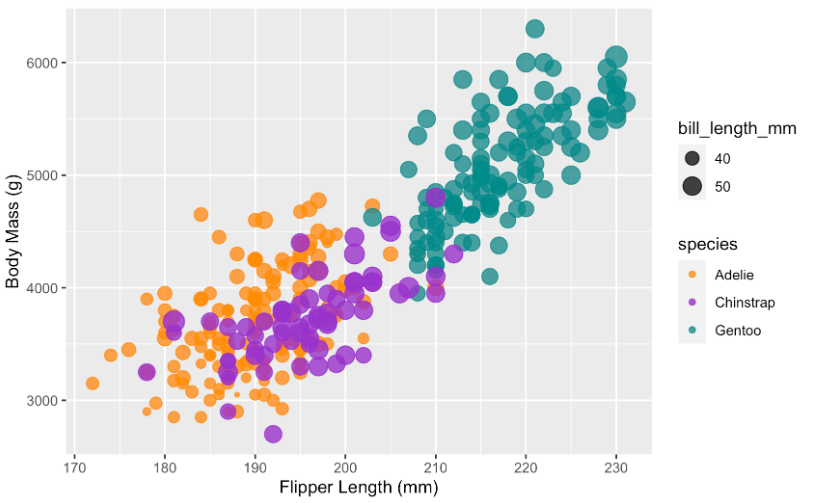
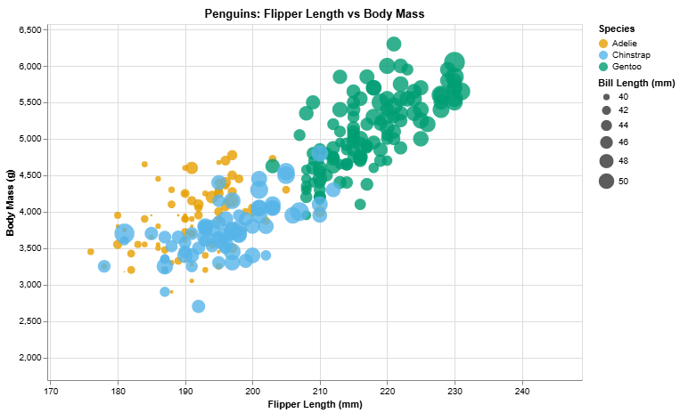
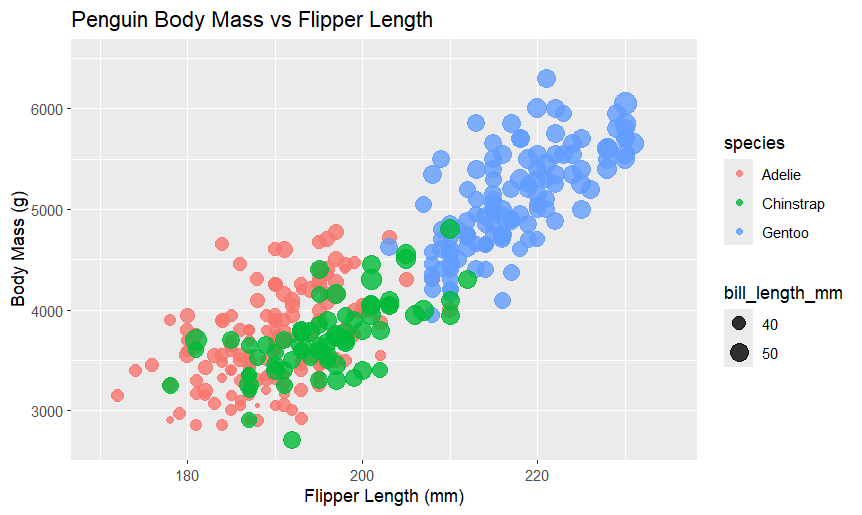
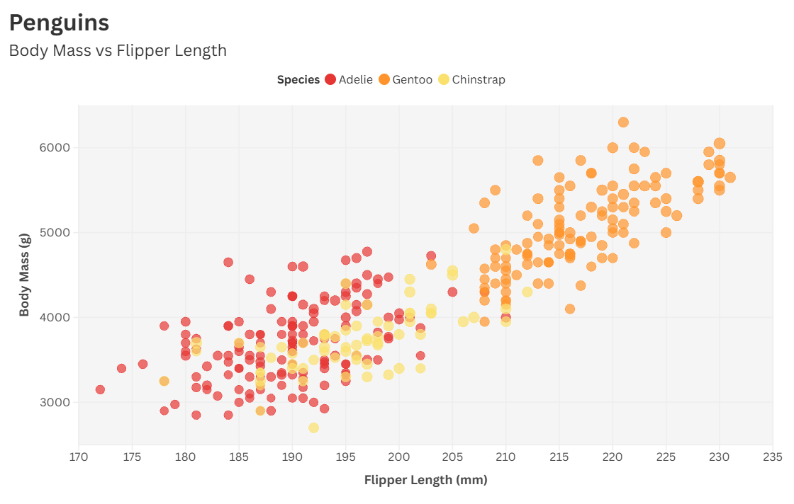

# Data Visualization: 5 Tools
Leala Carbonneau

## Tools Used

### D3.js

Web-based interactive chart using JavaScript. Made custom legends and responsive design. Had to manually set up all scales and axes.

### Vega-Lite  

JSON-based visualization grammar. Created faceted charts showing each species separately. Easy to add tooltips and interactions.

### Altair

Python library built on Vega-Lite. Used Jupyter notebook for development. Clean syntax but creates multiple small plots instead of one big one.

### R + ggplot2

Statistical plotting system for R. Layered approach with grammar of graphics. Great for publication-ready static plots.

### Flourish

Web-based platform for interactive charts. No coding needed, just upload data and customize. Good for quick web visualizations.

## Technical & Design Achievements

**Technical:**
- All tools needed data cleaning for missing values
- Created interactive features (tooltips, legends, hover effects)
- Used colorblind-friendly palettes across all visualizations
- Implemented proper scaling for size mappings

**Design:**
- Consistent color schemes for species identification
- Clean axis labels and professional appearance
- Appropriate element sizing for readability
- Good contrast and accessibility considerations

## What I Learned

- **D3.js**: Most control but requires lots of code
- **Vega-Lite**: Good balance of power and simplicity  
- **Altair**: Great for Python workflows
- **ggplot2**: Best for static, publication plots
- **Flourish**: Fastest for web-ready interactive charts

## Files

- `d3/` - D3.js implementation
- `vega-lite/` - Vega-Lite JSON spec
- `altair/` - Python notebook
- `r-ggplot/` - R script
- `flourish/` - Flourish export
- `img/` - Screenshots of all visualizations
